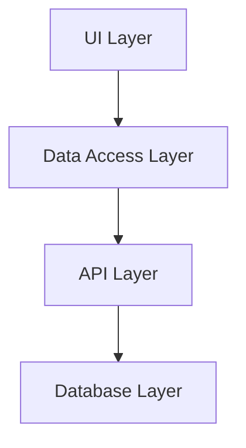
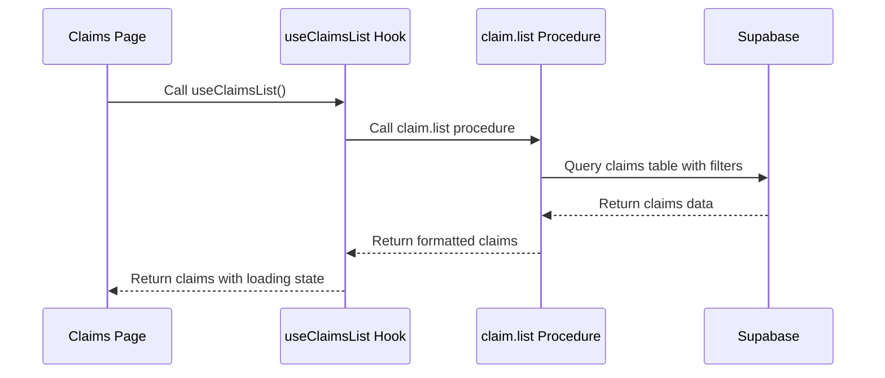
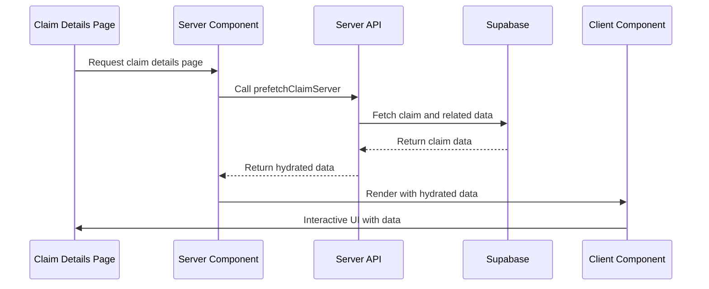
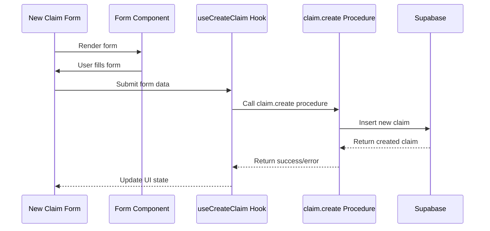

# ClaimTech Application Flow

This document details the data flow and component interactions in the ClaimTech application, providing a comprehensive guide for understanding how different parts of the system work together.

## Application Layers

The application follows a clear separation of concerns with distinct layers:



### 1. UI Layer

The UI layer consists of React components organized in a hierarchical structure:

- **Layout Components** (`CPA/src/components/layout/`)
  - `Layout.tsx` - Main application layout
  - `AppSidebar.tsx` - L-shaped sidebar with navigation
  - `ClaimCountsProvider.server.tsx` - Server component for claim counts

- **Page Components** (`CPA/src/app/`)
  - `claims/page.tsx` - Claims list page
  - `claims/[id]/page.tsx` - Claim details page
  - `claims/new/page.tsx` - New claim form

- **Feature Components** (`CPA/src/features/`)
  - Domain-specific components organized by feature

- **UI Components** (`CPA/src/components/ui/`)
  - Generic, reusable UI components (buttons, cards, etc.)

### 2. Data Access Layer (DAL)

The DAL provides a clean abstraction over the API layer, handling data fetching, caching, and state management:

- **API Client** (`CPA/src/lib/api/client.ts`)
  - Configures the tRPC client

- **Domain-Specific Modules** (`CPA/src/lib/api/domains/`)
  - `claims/` - Claims-related data access
  - `clients/` - Clients-related data access
  - `vehicles/` - Vehicles-related data access

- **Hooks** (`CPA/src/lib/api/domains/*/hooks.ts`)
  - React hooks for data fetching and mutations
  - Implements TanStack Query for caching and state management

### 3. API Layer

The API layer provides type-safe endpoints for data operations:

- **tRPC Routers** (`CPA/src/server/api/routers/`)
  - `claim.ts` - Claim-related endpoints
  - `client.ts` - Client-related endpoints
  - `vehicle.ts` - Vehicle-related endpoints

- **API Routes** (`CPA/src/app/api/trpc/[...trpc]/route.ts`)
  - Next.js API route for tRPC

### 4. Database Layer

The database layer handles data persistence using Supabase:

- **Supabase Client** (`CPA/src/server/api/trpc.ts`)
  - Creates and configures the Supabase client

- **Database Schema** (`CPA/src/db/schema.ts`)
  - Defines the database schema

## Data Flow Examples

### 1. Fetching Claims List



**Implementation:**
1. `CPA/src/app/claims/page.tsx` - Server component that prefetches claims
2. `CPA/src/app/claims/client-claims.tsx` - Client component that renders claims list
3. `CPA/src/lib/api/domains/claims/hooks.ts` - Contains `useClaimsList` hook
4. `CPA/src/server/api/routers/claim.ts` - Contains `list` procedure

### 2. Viewing Claim Details



**Implementation:**
1. `CPA/src/app/claims/[id]/page.tsx` - Server component that fetches claim details
2. `CPA/src/lib/api/domains/claims/server-prefetch.server.ts` - Server-side prefetch function
3. `CPA/src/app/claims/[id]/TabContainer.client.tsx` - Client component for tab navigation
4. `CPA/src/app/claims/[id]/tabs/` - Tab components for different sections

### 3. Creating a New Claim



**Implementation:**
1. `CPA/src/app/claims/new/page.tsx` - New claim page
2. `CPA/src/app/claims/new/new-claim-form.tsx` - Form component
3. `CPA/src/lib/api/domains/claims/mutations.ts` - Contains claim creation logic
4. `CPA/src/server/api/routers/claim.ts` - Contains `create` procedure

## Component Nesting Structure

### Main Layout

```
Layout (client)
└── ClaimCountsProvider (server)
    └── AppSidebar (client)
        └── Navigation Items
    └── Main Content Area
        └── Page Content
```

### Claims List Page

```
ClaimsPage (server)
└── ClientClaims (client)
    └── DataTable
        └── ClaimRow
            └── ExpandableRow
                └── ClaimActions
```

### Claim Details Page

```
ClaimDetailsPage (server)
└── TabContainer (client)
    └── TabsList
        └── TabsTrigger (for each tab)
    └── TabsContent
        └── OverviewTab (server)
        └── AppointmentTab (server)
        └── InspectionTab (server)
        └── ThreeSixtyTab (server)
        └── EstimateTab (server)
        └── PreIncidentTab (server)
```

## Key Workflows

### 1. Navigation Flow

1. User navigates to `/claims`
2. Server renders ClaimsPage with prefetched data
3. Client-side components handle interactions
4. When user clicks on a claim, prefetching starts on hover
5. Navigation to `/claims/[id]` occurs on click
6. Server renders ClaimDetailsPage with all tab data
7. Client-side TabContainer handles tab switching without additional fetches

### 2. Form Submission Flow

1. User navigates to `/claims/new`
2. Form renders with client-side validation
3. User fills form across multiple tabs
4. On submit, client validates all data
5. If valid, mutation is triggered
6. Optimistic UI updates show success immediately
7. Background API call creates the claim
8. On success, user is redirected to the new claim
9. On error, form shows error state and retains data

## Server-Side vs. Client-Side Components

### Server Components

- `CPA/src/app/*/page.tsx` - Page components
- `CPA/src/app/claims/[id]/tabs/*/*.tsx` - Tab content components
- `CPA/src/components/layout/ClaimCountsProvider.server.tsx` - Claim counts provider

### Client Components

- `CPA/src/app/claims/client-claims.tsx` - Client-side claims list
- `CPA/src/app/claims/[id]/TabContainer.client.tsx` - Tab container
- `CPA/src/components/layout/Layout.tsx` - Main layout
- `CPA/src/components/layout/AppSidebar.tsx` - Sidebar

## Related Documentation

For more detailed information, refer to these memory bank files:

- [index.md](@memory-bank/index.md) - High-level application structure
- [systemPatterns.md](@memory-bank/systemPatterns.md) - Architectural patterns
- [techContext.md](@memory-bank/techContext.md) - Technology stack details
